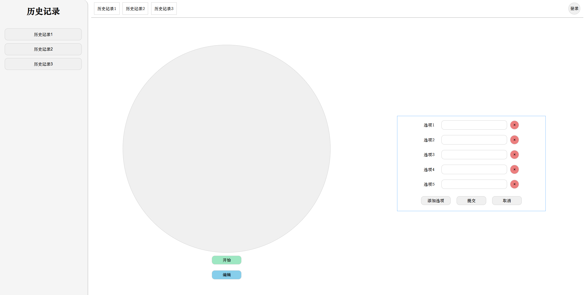
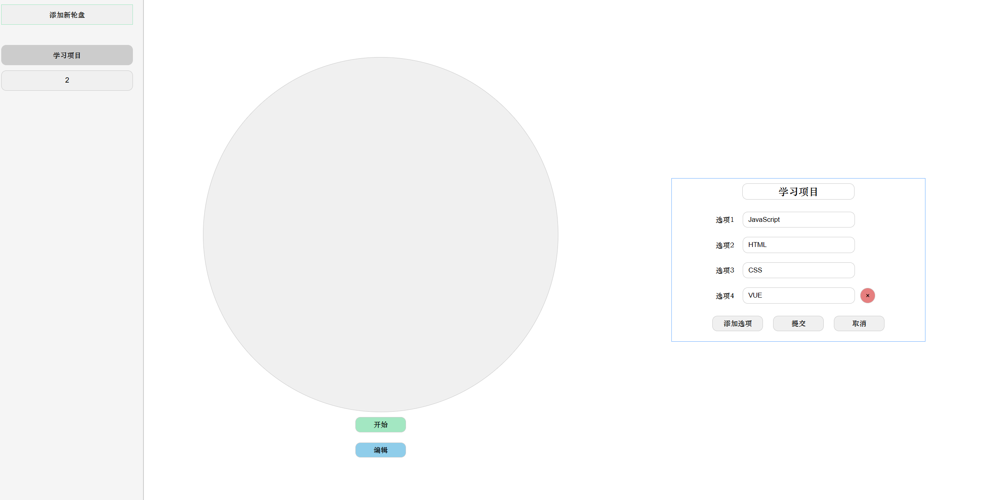
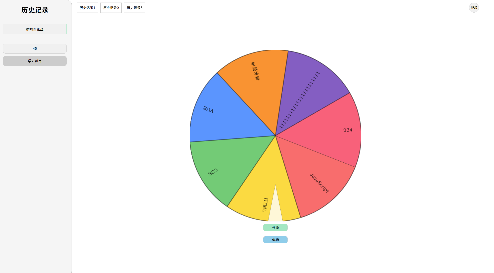
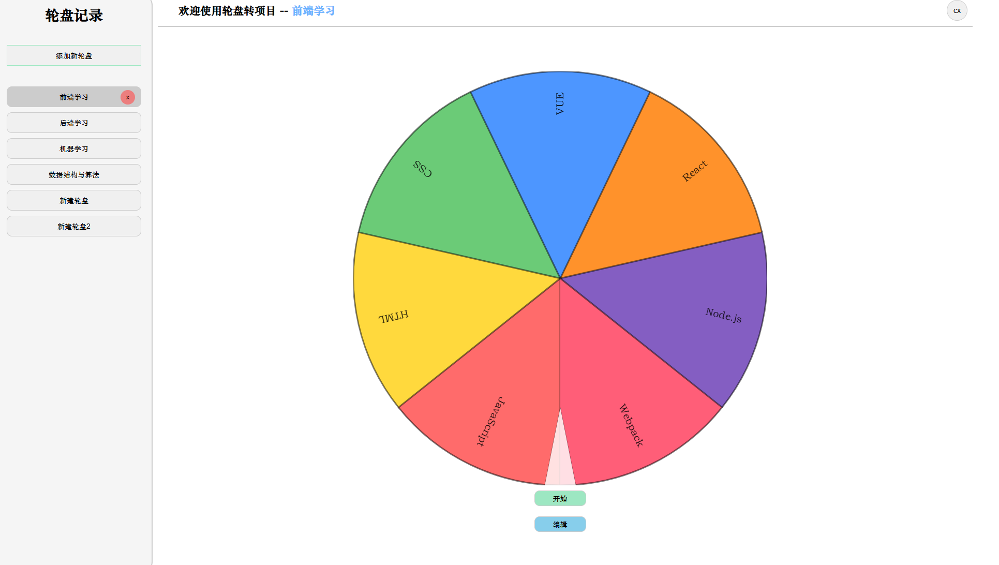

## 实现效果

实现一个轮盘转小项目，技术栈包括：

- HTML + JavaScript + CSS 实现前端界面设计
- 使用Node.js 实现后端接口设计 (Express)
- 使用JS模块化设计
- 使用Axios 实现前端与后端数据交互
- 数据通过文本文件存储， 通过File API 实现文件读写
- 通过`token`实现登录验证。

## 前端界面设计

- 主界面包括菜单栏，导航器，轮盘展示区
- 菜单栏记录 创建的 历史记录
- 导航器记录 当前选择的历史记录 以及 个人信息按钮 退出按钮
- 轮盘展示区 实现轮盘数据加载 轮盘选择 以及 结果展示



- 使用HTML + JS + CSS实现菜单栏、导航栏
- CSS选择器，CSS定位
- Flex布局
- Canvas
- Form表单

## JS DOM 实现效果

1. 加载前端页面时，初始化菜单栏，JS 请求后端历史记录，并创建button标签渲染页面。
   - `document.getElementsByClassName('menu-item')`返回的是类数组对象`HTMLCollect`
2. 菜单栏按钮绑定点击事件， 将当前标签设置active， 轮盘展示区由不可见显示为可见.
3. 编辑按钮，编辑轮盘数据，当前轮盘数据加载到表单中，如果是新建的默认保存二个空白选项。
   - `DOM`文本操作
4. 表单的按钮，提交按钮保存数据，新建表单项，取消表单，删除表单项
   - 表单的创建和删除按照先进后出的模式，每次删除最下面的表单项
   - 提交按钮提交数据给后端，后端获取数据写入文件中保存
5. 鼠标放到菜单栏选项上，出现能够删除按钮



## Canvas教程

`<canvas>`元素创造了一个固定大小的画布，它公开了一个或多个**渲染上下文**，其可以用来绘制和处理要展示的内容。我们将会将注意力放在 2D 渲染上下文中。可以通过`JavaScript`在画布中绘制内容。 

| 分类            | 方法 / 属性                               | 作用                                 | 示例                                            |
| --------------- | ----------------------------------------- | ------------------------------------ | ----------------------------------------------- |
| **获取上下文**  | `getContext("2d")`                        | 获取 2D 渲染上下文                   | `const ctx = canvas.getContext("2d")`           |
| **矩形**        | `fillRect(x,y,w,h)`                       | 绘制填充矩形                         | `ctx.fillRect(10,10,100,50)`                    |
|                 | `strokeRect(x,y,w,h)`                     | 绘制矩形边框                         | `ctx.strokeRect(10,10,100,50)`                  |
|                 | `clearRect(x,y,w,h)`                      | 清除矩形区域                         | `ctx.clearRect(20,20,30,30)`                    |
| **路径**        | `beginPath()`                             | 开始新路径                           | `ctx.beginPath()`                               |
|                 | `closePath()`                             | 闭合路径                             | `ctx.closePath()`                               |
|                 | `moveTo(x,y)`                             | 移动画笔位置                         | `ctx.moveTo(50,50)`                             |
|                 | `lineTo(x,y)`                             | 绘制直线                             | `ctx.lineTo(150,50)`                            |
|                 | `arc(x,y,r,start,end)`                    | 绘制圆/弧                            | `ctx.arc(100,75,50,0,Math.PI*2)`                |
|                 | `rect(x,y,w,h)`                           | 定义矩形路径                         | `ctx.rect(20,20,150,100)`                       |
|                 | `fill()`                                  | 填充路径                             | `ctx.fill()`                                    |
|                 | `stroke()`                                | 绘制路径边框                         | `ctx.stroke()`                                  |
| **绘制样式**    | `fillStyle`                               | 设置填充颜色                         | `ctx.fillStyle="red"`                           |
|                 | `strokeStyle`                             | 设置边框颜色                         | `ctx.strokeStyle="blue"`                        |
|                 | `lineWidth`                               | 设置线条宽度                         | `ctx.lineWidth=5`                               |
|                 | `lineCap`                                 | 设置线端样式（butt, round, square）  | `ctx.lineCap="round"`                           |
|                 | `lineJoin`                                | 设置拐角样式（miter, bevel, round）  | `ctx.lineJoin="bevel"`                          |
| **渐变**        | `createLinearGradient(x1,y1,x2,y2)`       | 创建线性渐变                         | `ctx.createLinearGradient(0,0,200,0)`           |
|                 | `createRadialGradient(x1,y1,r1,x2,y2,r2)` | 创建径向渐变                         | `ctx.createRadialGradient(50,50,20,50,50,100)`  |
|                 | `addColorStop(pos,color)`                 | 添加渐变颜色                         | `grad.addColorStop(0,"red")`                    |
| **文本**        | `font`                                    | 设置字体样式                         | `ctx.font="20px Arial"`                         |
|                 | `fillText(text,x,y)`                      | 绘制填充文字                         | `ctx.fillText("Hello",50,50)`                   |
|                 | `strokeText(text,x,y)`                    | 绘制描边文字                         | `ctx.strokeText("World",50,80)`                 |
|                 | `textAlign`                               | 文本对齐方式（left, center, right）  | `ctx.textAlign="center"`                        |
|                 | `textBaseline`                            | 基线位置（top, middle, bottom）      | `ctx.textBaseline="middle"`                     |
| **图片**        | `drawImage(img,x,y)`                      | 绘制图片                             | `ctx.drawImage(img,0,0)`                        |
|                 | `drawImage(img,x,y,w,h)`                  | 缩放绘制                             | `ctx.drawImage(img,0,0,100,100)`                |
|                 | `drawImage(img,sx,sy,sw,sh,dx,dy,dw,dh)`  | 裁剪+缩放绘制                        | `ctx.drawImage(img,50,50,100,100,0,0,200,200)`  |
| **变换**        | `translate(x,y)`                          | 移动画布原点                         | `ctx.translate(100,100)`                        |
|                 | `rotate(angle)`                           | 旋转（弧度制）                       | `ctx.rotate(Math.PI/4)`                         |
|                 | `scale(x,y)`                              | 缩放                                 | `ctx.scale(2,1.5)`                              |
|                 | `save()`                                  | 保存当前状态                         | `ctx.save()`                                    |
|                 | `restore()`                               | 恢复到上一次保存的状态               | `ctx.restore()`                                 |
| **像素操作**    | `getImageData(x,y,w,h)`                   | 获取像素数据                         | `ctx.getImageData(0,0,100,100)`                 |
|                 | `putImageData(data,x,y)`                  | 放回像素数据                         | `ctx.putImageData(imgData,0,0)`                 |
|                 | `createImageData(w,h)`                    | 创建空白像素数据                     | `ctx.createImageData(100,100)`                  |
| **合成 & 裁剪** | `globalAlpha`                             | 设置透明度                           | `ctx.globalAlpha=0.5`                           |
|                 | `globalCompositeOperation`                | 合成模式（source-over, multiply 等） | `ctx.globalCompositeOperation="lighter"`        |
|                 | `clip()`                                  | 裁剪路径区域                         | `ctx.clip()`                                    |
| **动画**        | `requestAnimationFrame(fn)`               | 绘制动画（推荐）                     | `requestAnimationFrame(draw)`                   |
|                 | `clearRect(x,y,w,h)`                      | 清空画布（常用于动画）               | `ctx.clearRect(0,0,canvas.width,canvas.height)` |

### 基础教程

#### 1. 创建 Canvas

```js
<canvas id="myCanvas" width="500" height="300" style="border:1px solid black;"></canvas>
<script>
const canvas = document.getElementById("myCanvas");
const ctx = canvas.getContext("2d");  // 获取 2D 绘图上下文
</script>
```

`getContext(contextType, contextAttributes)`方法返回`canvas` 的上下文，如果上下文没有定义则返回 [`null`](https://developer.mozilla.org/zh-CN/docs/Web/JavaScript/Reference/Operators/null) .

[`contextType`](https://developer.mozilla.org/zh-CN/docs/Web/API/HTMLCanvasElement/getContext#contexttype)

是一个指示使用何种上下文的 [`DOMString`](https://developer.mozilla.org/zh-CN/docs/Web/JavaScript/Reference/Global_Objects/String) 。可能的值是：

- `"2d`", 建立一个 [`CanvasRenderingContext2D`](https://developer.mozilla.org/zh-CN/docs/Web/API/CanvasRenderingContext2D) 二维渲染上下文。`"webgl"` (或`"experimental-webgl"`) 这将创建一个 [`WebGLRenderingContext`](https://developer.mozilla.org/zh-CN/docs/Web/API/WebGLRenderingContext) 三维渲染上下文对象。只在实现[WebGL](https://developer.mozilla.org/zh-CN/docs/Web/API/WebGL_API) 版本 1(OpenGL ES 2.0) 的浏览器上可用。
- "`webgl2`" (或 "`experimental-webgl2`") 这将创建一个 [`WebGL2RenderingContext`](https://developer.mozilla.org/zh-CN/docs/Web/API/WebGL2RenderingContext) 三维渲染上下文对象。只在实现 [WebGL](https://developer.mozilla.org/zh-CN/docs/Web/API/WebGL_API) 版本 2 (OpenGL ES 3.0) 的浏览器上可用。
- `"bitmaprenderer"` 这将创建一个只提供将 canvas 内容替换为指定[`ImageBitmap`](https://developer.mozilla.org/zh-CN/docs/Web/API/ImageBitmap)功能的[`ImageBitmapRenderingContext`](https://developer.mozilla.org/zh-CN/docs/Web/API/ImageBitmapRenderingContext) 。

#### 2. 绘制基本形状

矩形

```js
// 填充矩形
ctx.fillStyle = "blue";
ctx.fillRect(50, 50, 100, 80);

// 边框矩形
ctx.strokeStyle = "red";
ctx.strokeRect(200, 50, 100, 80);

// 清除矩形区域
ctx.clearRect(60, 60, 40, 40);
```

线条

```js
ctx.beginPath();
ctx.moveTo(50, 200);  // 起点
ctx.lineTo(200, 250); // 终点
ctx.stroke();         // 绘制
```

圆形 / 弧线

```js
ctx.beginPath();
ctx.arc(350, 100, 50, 0, Math.PI * 2); // 圆心(350,100)，半径50
ctx.fillStyle = "green";
ctx.fill();
ctx.stroke();
```

#### 3. 绘制文本

```js
ctx.font = "24px Arial";
ctx.fillStyle = "purple";
ctx.fillText("Hello Canvas", 50, 150);   // 填充文字

ctx.strokeStyle = "black";
ctx.strokeText("描边文字", 50, 180);       // 描边文字
```

#### 4. 渐变 & 图片

线性渐变

```js
const gradient = ctx.createLinearGradient(0, 0, 200, 0);
gradient.addColorStop(0, "red");
gradient.addColorStop(1, "yellow");

ctx.fillStyle = gradient;
ctx.fillRect(50, 200, 200, 100);
```

绘制图片

```js

<canvas id="myCanvas" width="500" height="400"></canvas>
<script>
const canvas = document.getElementById("myCanvas");
const ctx = canvas.getContext("2d");
const img = document.getElementById("logo");
img.onload = () => {
  ctx.drawImage(img, 300, 200, 100, 100);
};
</script>
```

#### 5. 动画（关键）

利用 `requestAnimationFrame` 循环刷新画布：

```js
let x = 0;
function draw() {
  ctx.clearRect(0, 0, canvas.width, canvas.height); // 清空画布

  ctx.beginPath();
  ctx.arc(x, 150, 30, 0, Math.PI * 2);
  ctx.fillStyle = "blue";
  ctx.fill();

  x += 2; // 移动
  if (x > canvas.width) x = 0;

  requestAnimationFrame(draw); // 循环调用
}
draw();
```

#### 6. 交互（鼠标事件）

```js
canvas.addEventListener("click", (e) => {
  const rect = canvas.getBoundingClientRect();
  const x = e.clientX - rect.left;
  const y = e.clientY - rect.top;
  console.log("点击坐标:", x, y);

  ctx.fillStyle = "red";
  ctx.fillRect(x-5, y-5, 10, 10);
});
```

#### 7. 学习路径

1. **基础图形**（矩形、圆、线条、路径）
2. **样式**（颜色、渐变、阴影、线宽）
3. **文本和图片**（fillText / drawImage）
4. **动画**（requestAnimationFrame）
5. **交互**（鼠标、键盘事件）
6. **进阶**（像素操作、合成模式、游戏开发）

### 使用模板

```js
// canvas 使用模板
const canvas = document.getElementById('wheel') // 获取canvas元素
const ctx = canvas.getContext('2d') // 获取上下文
canvas.width = canvas.clientWidth // 画布宽度
canvas.height = canvas.clientHeight // 画布高度
ctx.clearRect(0, 0, canvas.width, canvas.height) // 清除画布
ctx.save() // 保存当前状态
// 相关操作
ctx.translate(canvas.width / 2, canvas.height / 2) // 坐标点移动到中心
ctx.rotate(Math.PI / 2) // 旋转90度
ctx.beginPath() // 开始路径
ctx.fillStyle = 'white' // 样式设置
ctx.arc(0, 0, canvas.width / 2, 0, 2 * Math.PI) // 绘制圆
ctx.fill() // 填充 
ctx.closePath() // 关闭路径
ctx.restore() // 恢复状态
// 箭头
ctx.beginPath();
ctx.moveTo(radius-30, radius * 2);
ctx.lineTo(radius + 30, radius * 2);
ctx.lineTo(radius, radius * 2 - 150);
ctx.closePath();
ctx.fillStyle = 'rgba(255,255,255,0.8)';
ctx.strokeStyle = 'rgba(0,0,0,0.5)'
ctx.stroke()
ctx.fill();
```

- `ctx.save()` 和 `ctx.restore()`这两个是 **保存和恢复绘图状态** 的。 实现局部改变样式和坐标系，比如想要轮盘旋转 但是 箭头保持不变。

- `ctx.beginPath()` 和 `ctx.closePath()`

  这两个是 **控制路径（path）** 的。

  - `beginPath()`：开启一个新路径，之前的路径不会再受影响。

  - `closePath()`：将当前路径 **首尾相连**（可选）。
  
- `requestAnimationFrame(animate);` 是浏览器提供的一个动画循环机制。每次屏幕刷新（通常 60fps ≈ 16.7ms 一次），会自动调用你传入的函数（这里是 `animate`）。这样能保证动画 **流畅**，比 `setInterval` 更节能。

  为什么不用 `setInterval`？

  - `requestAnimationFrame` 会自动跟随浏览器刷新率，不卡顿。
  - 当页面切换到后台时，会暂停调用，不浪费资源。
  - 适合做 Canvas 动画、游戏、转盘这种场景。

避免多个图形混在同一个路径里（比如画两个不相干的圆，必须 `beginPath()` 否则会连在一起）。**不同路径的样式会互相影响 —— 如果你不调用 `beginPath()`。** 但一旦用了 `beginPath()`，新路径和旧路径就分开了，可以用完全不同的样式，互不干扰。



## 后端接口设计

前端通过axios 和 后端express进行数据交互
- 跨域问题
- 请求历史数据、请求写入数据、请求删除数据
- 使用token管理会话


